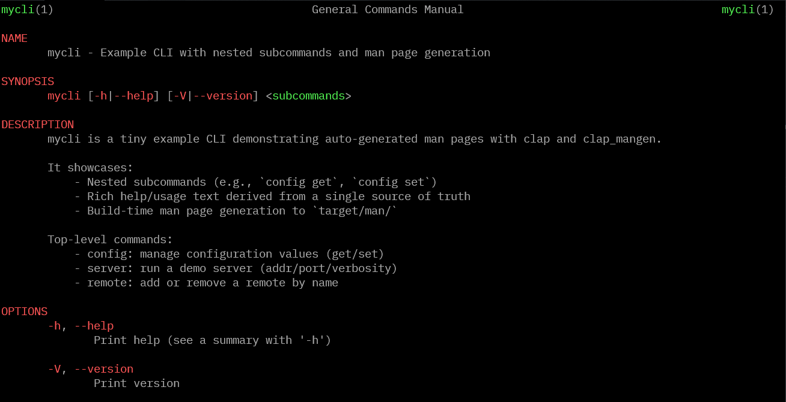

# How to easily create a CLI in Rust using clap and clap_mangen

Define your CLI once with `clap` derive, run it at runtime, and auto-generate man pages at build time with `clap_mangen`—all from the same source of truth. For the full working example, see: https://github.com/0xle0ne/clap-mangen-example



## What's a "man page" and why care?

"man" stands for manual. On Unix-like systems, `man <topic>` opens documentation in your terminal (e.g., `man ls`). Shipping man pages with your CLI means:

- Built-in help offline: users can read docs without internet.
- Consistent UX: `mycli`, `mycli --help`, and `man mycli` all tell the same story.
- Easy discovery: `man -k mycli` (apropos) lets users find related commands.

## Quick setup

Install dependencies first, then you're ready to follow along:

```sh
cargo add clap --features derive
cargo add clap --build --features derive
cargo add clap_mangen --build
```

This yields a `Cargo.toml` like:

```toml
[package]
name = "mycli"
version = "0.1.0"
edition = "2021"
build = "build.rs"

[dependencies]
clap = { version = "4", features = ["derive"] }

[build-dependencies]
clap = { version = "4", features = ["derive"] }
clap_mangen = "0.2"
```

## Why this is neat

- Single source of truth: the derive types drive runtime parsing and documentation.
- No stale docs: man pages regenerate on build when the CLI changes.
- Great for packaging: ship `target/man/*.1` or install them into `/usr/share/man`.
- Works with nested subcommands out of the box.

## The CLI definition (derive)

We define the entire CLI under `src/cli.rs` using `clap` derive. Both the binary and the build script reuse these types.

```rust
// in src/cli.rs
use clap::{Command, CommandFactory, Parser};

// Longer description used for the top-level man page section.
const LONG_ABOUT: &str = r#"
mycli is a tiny example CLI demonstrating auto-generated man pages with clap and clap_mangen.

It showcases:
    - Nested subcommands (e.g., `config get`, `config set`)
    - Rich help/usage text derived from a single source of truth
    - Build-time man page generation to `target/man/`

Top-level commands:
    - config: manage configuration values (get/set)
    - server: run a demo server (addr/port/verbosity)
    - remote: add or remove a remote by name
"#;

/// mycli — a tiny example CLI used to demonstrate auto-generated man pages.
#[derive(Debug, Parser)]
#[command(
    name = "mycli",
    about = "Example CLI with nested subcommands and man page generation",
    long_about = LONG_ABOUT,
    version
)]
pub struct Cli {
    /// Top-level subcommand to execute
    #[command(subcommand)]
    pub command: Commands,
}
```

## Minimal runtime: `main.rs`

At runtime, you parse once and dispatch to the selected subcommand. Here's the essence from `src/main.rs`:

```rust
use clap::Parser;

mod cli;

fn main() {
    let opts = cli::Cli::parse();
    match opts.command {
        cli::Commands::Server(s) => {
            println!("server start on {}:{} (verbosity: {})", s.addr, s.port, s.verbose);
        }
        cli::Commands::Remote(r) => {
            if r.remove {
                println!("remote removed: {}", r.name);
            } else if let Some(url) = r.url {
                println!("remote added: {} -> {}", r.name, url);
            } else {
                println!("remote info requested: {}", r.name);
            }
        }
        cli::Commands::Config(cfg) => match cfg.action {
            cli::ConfigAction::Get(g) => println!("config get {} (format: {:?})", g.key, g.format),
            cli::ConfigAction::Set(s) => println!("config set {}={} (global: {})", s.key, s.value, s.global),
        },
    }
}
```

## Sharing CLI with `build.rs`

`build.rs` compiles as a separate crate, so we include the same `src/cli.rs` (and ensure `clap` is available in `[build-dependencies]` with `features=["derive"]`).

```rust
// in build.rs
mod cli {
	include!(concat!(env!("CARGO_MANIFEST_DIR"), "/src/cli.rs"));
}

let mut cmd = <cli::Cli as clap::CommandFactory>::command();
```

## Generating man pages recursively

`clap_mangen` can generate man pages for the root command and all nested subcommands with a single call:

```rust
let out_dir = manifest_dir.join("target").join("man");
std::fs::create_dir_all(&out_dir)?;
let mut cmd = <cli::Cli as clap::CommandFactory>::command();
clap_mangen::generate_to(&mut cmd, &out_dir)?; // writes mycli.1, mycli-config.1, mycli-config-get.1, etc.
```

The build script prints a cargo:warning showing where files were written.

## How the pieces fit together

Single source of truth: `src/cli.rs` contains all clap derive types for your CLI. Both runtime and the build script include this file so help text and structure never drift.

1) Runtime parsing (`src/main.rs`)
    - `Cli::parse()` builds values from the command line.
    - A simple `match` dispatches to the chosen subcommand.

2) Build-time docs (`build.rs`)
    - Includes `src/cli.rs` so it has the same `Command` layout.
    - Calls `clap_mangen::generate_to` on the root `Command`.
    - Recursively writes man pages for the root and every subcommand into `target/man/`.

3) Benefits
    - No duplicate specs for help vs. docs.
    - Man pages regenerate automatically on build when the CLI changes.
    - Great for packaging: ship `target/man/*.1` or install them into `/usr/share/man`.

## Try it locally

```bash
cargo build
ls target/man
man -l target/man/mycli.1          # root command
man -l target/man/mycli-config-get.1  # nested subcommand
```

## Caveats & tradeoffs

- `build.rs` runs on every build; heavy generation can slow iterative cycles. For bigger doc pipelines, consider a `cargo xtask` instead and run it on demand or in CI.
- Some doc hosts (e.g., docs.rs) restrict or ignore build script side effects. Keep it lightweight.
- If you need custom filenames/sections, use `clap_mangen::Man::new(cmd).render(&mut writer)` and recurse yourself.

## Next steps

- Package installers can place pages under `/usr/share/man/man1/`.
- Homebrew formulae can install `target/man/*.1` during `brew install`.
- Explore docs: [`clap` on docs.rs](https://docs.rs/clap) and [`clap_mangen` on docs.rs](https://docs.rs/clap_mangen) for advanced options.
